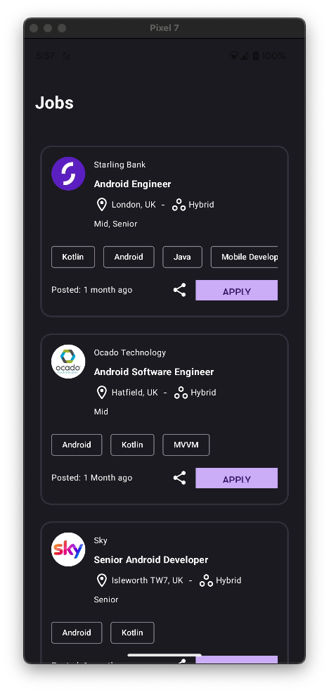
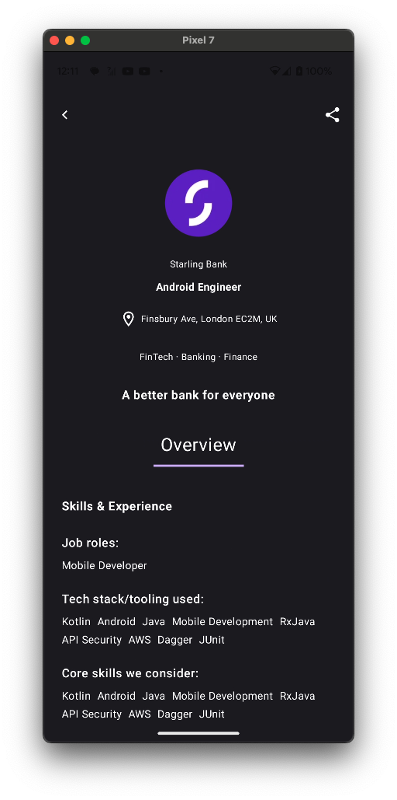
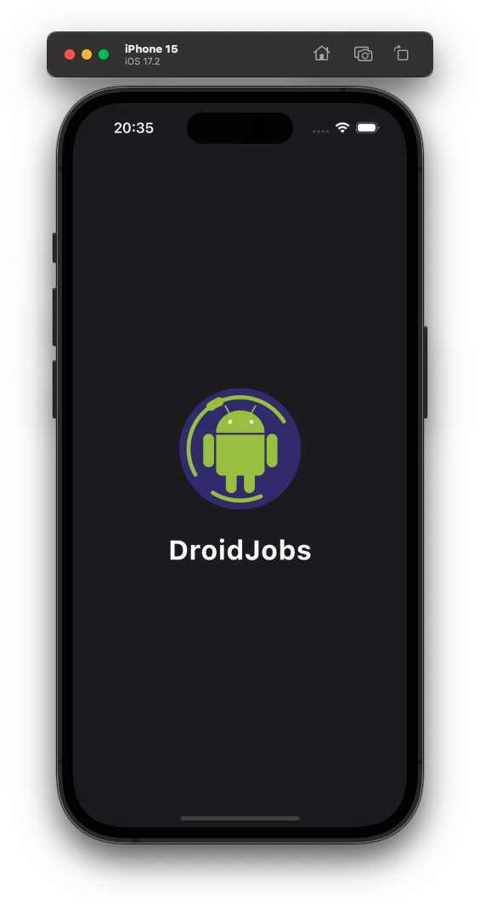
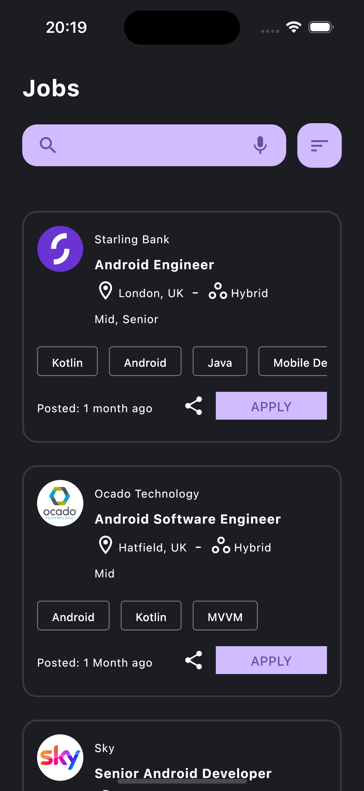
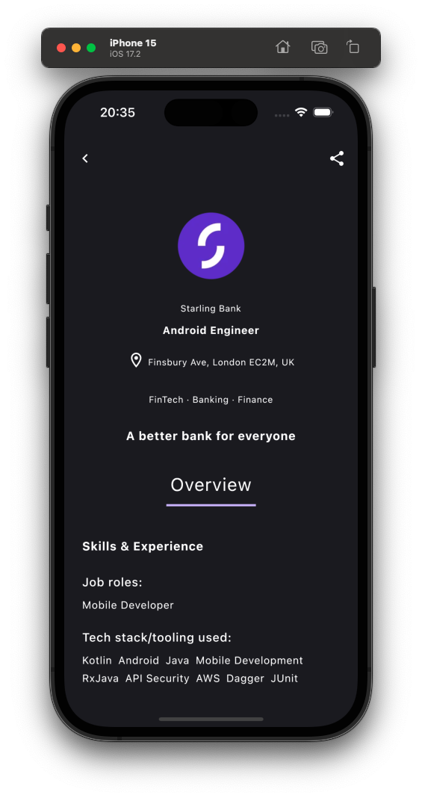
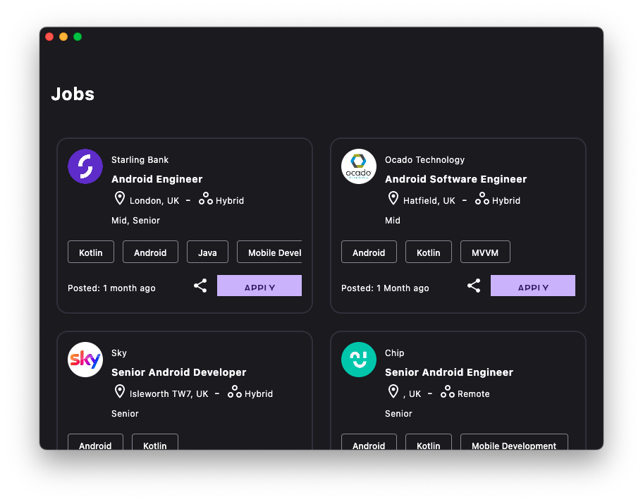
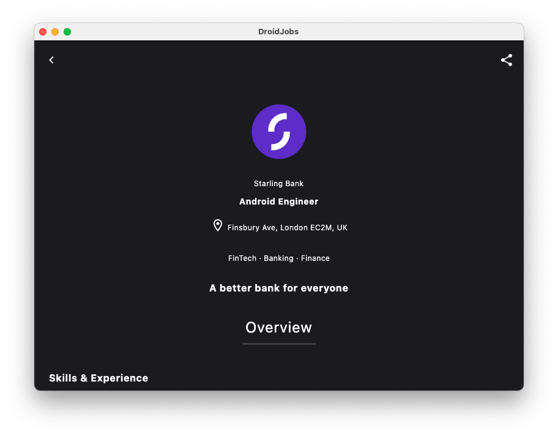
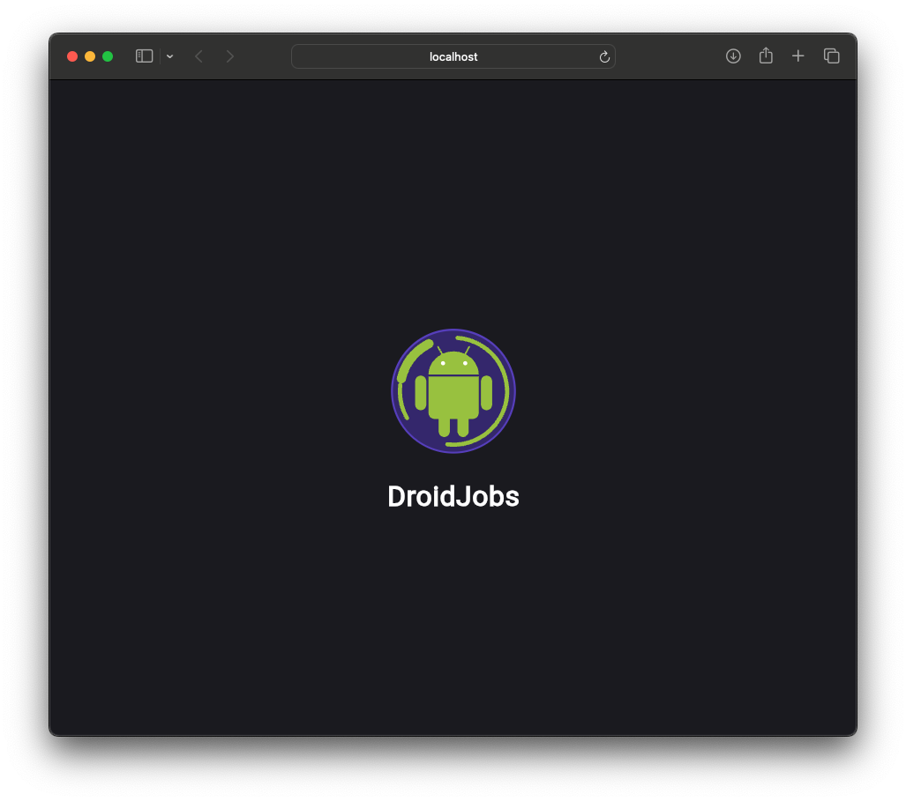
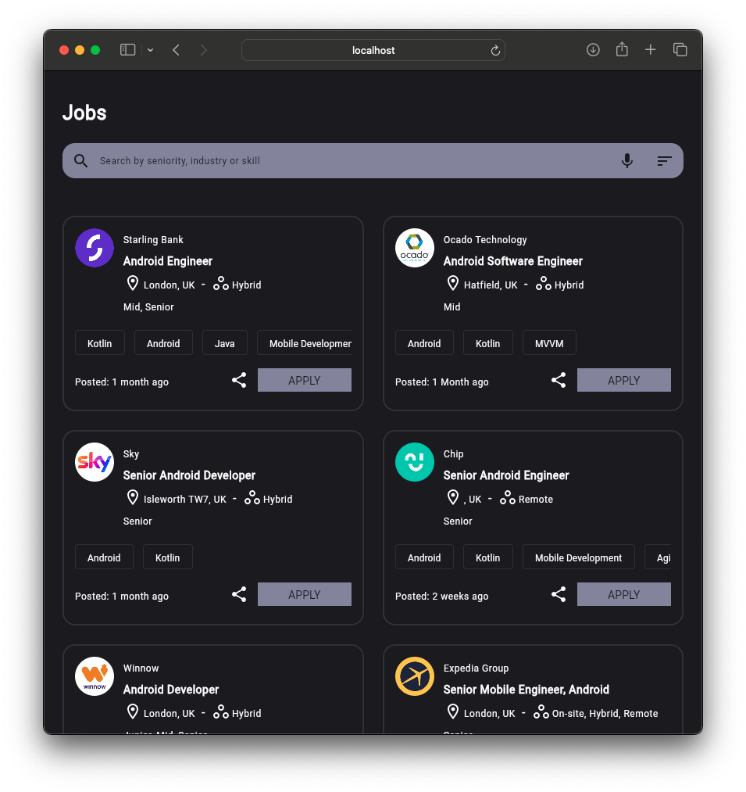
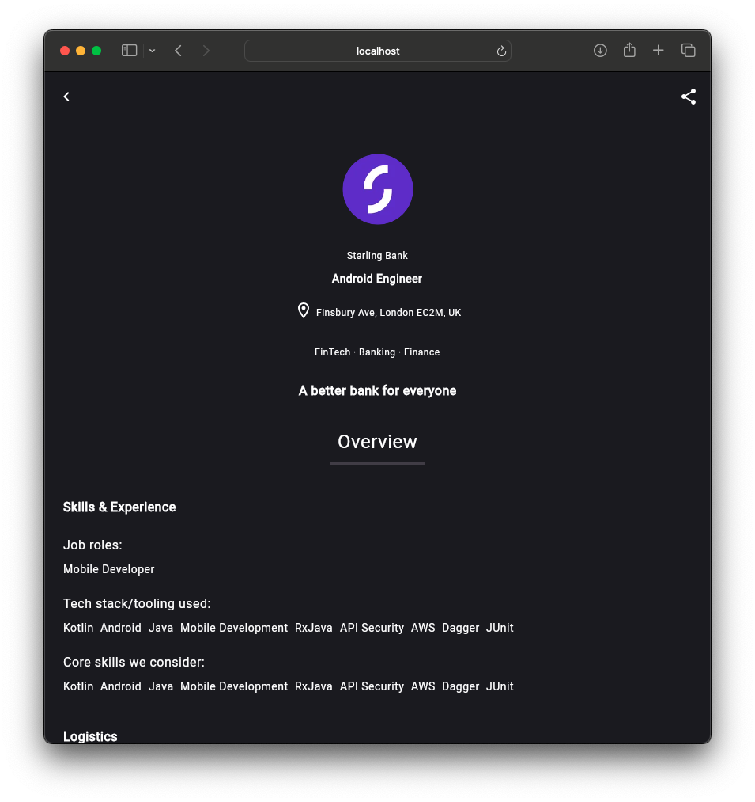

<H1>DroidJobsKMP</H1>

Kotlin Multiplatform job finder app, connecting you with the latest opportunities in the world of Android development. 
 

Supported Platforms
- Android
- IOS
- WEB
- Desktop

Web App - Live
[View](https://ismai117.github.io/DroidJobsKMP/) 
 
<pre>
<h2 align="center">Android</h2>
</pre>

  
  
  

<pre>  
<h2 align="center">IOS</h2>
</pre>

  
  
  

<pre> 
<h2 align="center">Desktop</h2>
</pre>

  
  
  

<pre> 
<h2 align="center">Web</h2>
</pre>

  
  
  

